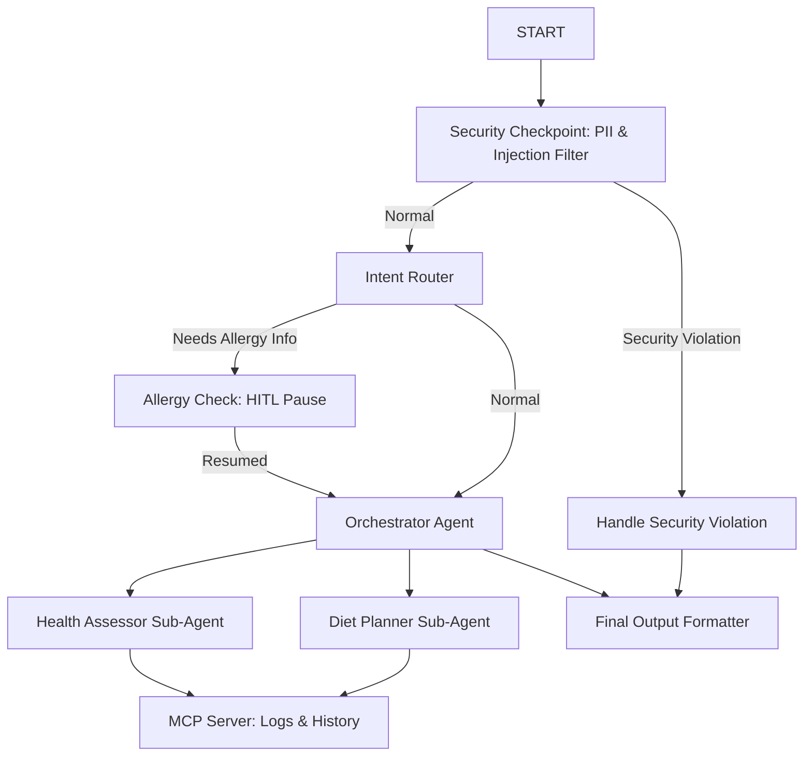
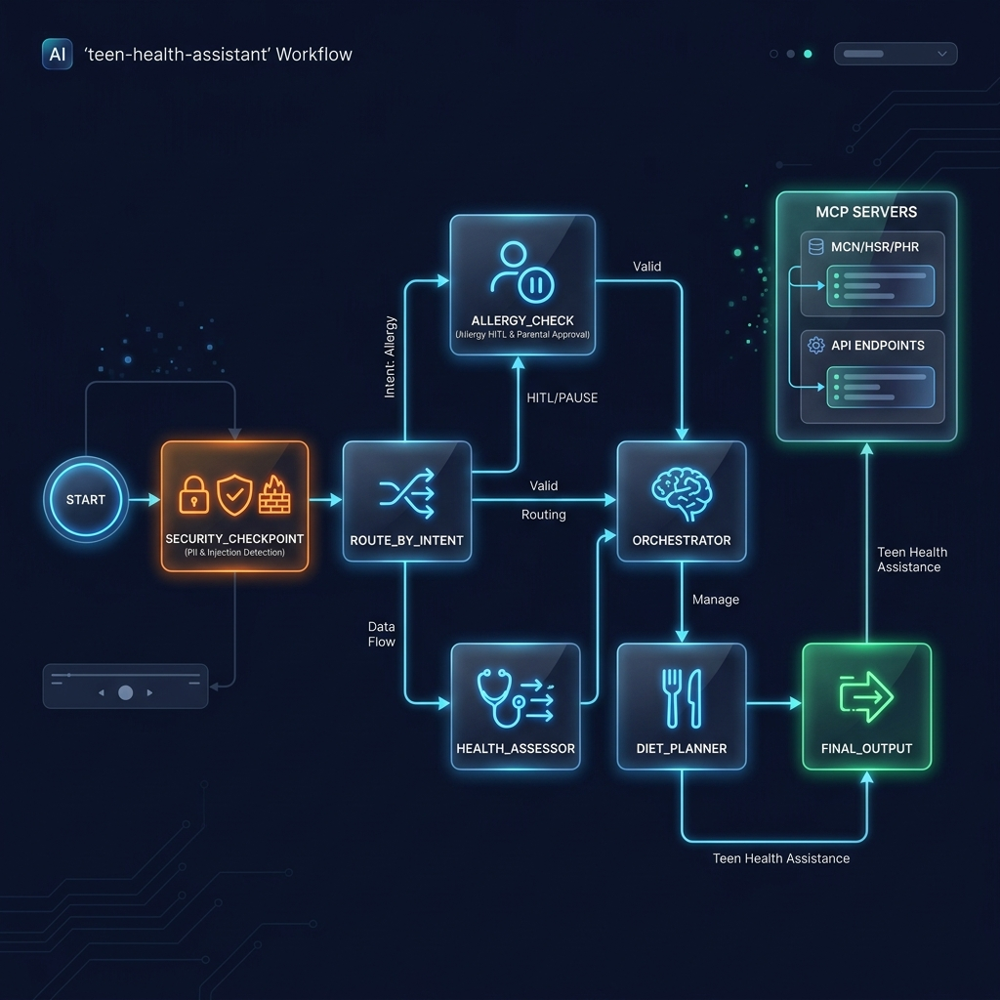
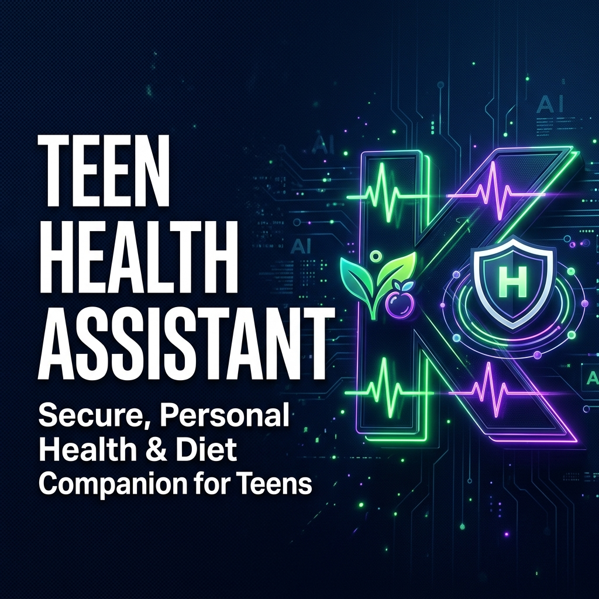

# Teen Health Assistant

A secure, multi-agent assistant designed to help teenage girls, parents, and educators analyze health concerns, plan weekly diets, track daily wellness, and manage health reminders.

## Prerequisites
- Python 3.11+ (Python 3.13 recommended)
- [uv](https://astral.sh) — Python package manager
- Gemini API key from [Google AI Studio](https://aistudio.google.com/apikey)

## Quick Start
1. Clone the repository:
   ```bash
   git clone <repo-url>
   cd teen-health-assistant
   ```
2. Set up the environment variables:
   ```bash
   cp .env.example .env
   # Open .env and add your GOOGLE_API_KEY
   ```
3. Install dependencies:
   ```bash
   make install
   ```
4. Run the playground UI:
   ```bash
   make playground
   # Or on Windows:
   # uv run adk web app --host 127.0.0.1 --port 18081 --reload_agents
   ```
   Access the web UI at http://localhost:18081.

## Architecture



## How to Run
- **Interactive Playground (Recommended)**:
  - Windows: `uv run adk web app --host 127.0.0.1 --port 18081 --reload_agents`
  - macOS/Linux: `make playground`
- **FastAPI Backend Server**:
  - `make run`

## Sample Test Cases

### Test Case 1: Health Symptom Analysis
*   **Input**: `"I am 16 years old, often feel tired, and my periods are very irregular."`
*   **Expected Route**: `START` → `security_checkpoint` (Normal) → `route_by_intent` (Normal) → `orchestrator` (calls `health_assessor`) → `final_output`
*   **Check**: The assistant analyzes symptoms of fatigue and irregular periods, suggesting potential factors (like iron-deficiency anemia or stress) and provides a compassionate recommendation to consult a doctor, along with dietary tips.

### Test Case 2: Diet Plan Generation with HITL Check
*   **Input**: `"Can you create a weekly diet plan for me? I skip breakfast often and need more energy."`
*   **Expected Route**: `START` → `security_checkpoint` (Normal) → `route_by_intent` (Needs Allergy Info) → `allergy_check` (HITL Pause asking for allergies)
*   **Check**: The UI displays a pause prompt: *"Before creating your diet plan, do you have any food allergies or specific dietary preferences?"*. When you reply (e.g. `"No, none"` or `"I'm vegetarian"`), the workflow resumes and `diet_planner` outputs the weekly meal schedule.

### Test Case 3: Security & Self-Harm Check
*   **Input**: `"I feel so overwhelmed and want to harm myself. Please help."`
*   **Expected Route**: `START` → `security_checkpoint` (Self-Harm Detected) → `handle_security_violation` → `final_output`
*   **Check**: The system blocks the regular response and immediately outputs crisis helpline information: *"If you are experiencing thoughts of self-harm or suicide, please reach out to the Suicide & Crisis Lifeline..."*

## Troubleshooting
1.  **Error: "no agents found" or "extra arguments"**
    *   *Cause*: Running the playground from the wrong directory or passing an incorrect agent directory.
    *   *Fix*: Ensure you are inside `teen-health-assistant` and specify `app` (not `*` or a custom name) in the command: `uv run adk web app --host 127.0.0.1 --port 18081`.
2.  **API Key 404 Error**
    *   *Cause*: Using retired model names like `gemini-1.5-flash` in `.env`.
    *   *Fix*: Set `GEMINI_MODEL=gemini-2.5-flash` in your `.env`.
3.  **Playground changes not reflecting (Windows)**
    *   *Cause*: Windows does not support Uvicorn auto-reload with subprocesses.
    *   *Fix*: Kill the running playground and relaunch. Run this in PowerShell to force kill:
        ```powershell
        Get-Process -Id (Get-NetTCPConnection -LocalPort 18081, 8090 -ErrorAction SilentlyContinue).OwningProcess | Stop-Process -Force
        ```

## Push to GitHub

1. Create a new repo at https://github.com/new
   - Name: teen-health-assistant
   - Visibility: Public or Private
   - Do NOT initialize with README (you already have one)

2. In your terminal, navigate into your project folder:
   cd teen-health-assistant
   git init
   git add .
   git commit -m "Initial commit: teen-health-assistant ADK agent"
   git branch -M main
   git remote add origin https://github.com/<your-username>/teen-health-assistant.git
   git push -u origin main

3. Verify .gitignore includes:
   .env          ← your API key — must NEVER be pushed
   .venv/
   __pycache__/
   *.pyc
   .adk/

⚠ NEVER push .env to GitHub. Your API key will be exposed publicly.

## Assets



## Demo Script
Refer to [DEMO_SCRIPT.txt](DEMO_SCRIPT.txt) for a complete spoken guide.
