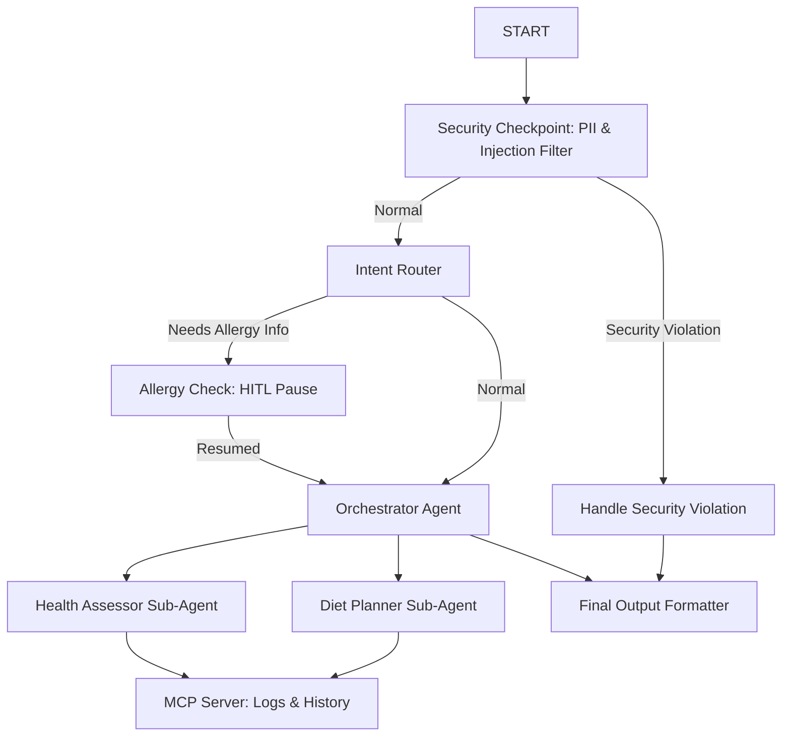

# Submission Write-Up: Teen Health Assistant

## Problem Statement
Adolescent health, specifically for teenage girls, involves unique physiological and psychological developments. Often, teenagers lack access to supportive, private, and secure spaces to seek guidance on topics like menstrual irregularities, fatigue, mental well-being, and diet. Additionally, parents and school counselors face challenges in helping teens log health trends and dietary habits. The Teen Health Assistant provides a private, conversational health partner that helps teenagers analyze symptoms, obtain dietary guidance, and log patterns while strictly enforcing data safety, PII scrubbing, and safety guardrails.

## Solution Architecture

## Concepts Used

1.  **ADK Workflow Graph API (ADK 2.0)**:
    *   Defined in [app/agent.py](file:///c:/Users/ADMIN/OneDrive/Documents/adk-workspace2/Capstone%20Project%202026/teen-health-assistant/app/agent.py#L187). It orchestrates nodes sequentially and conditionally (using route names) ensuring zero duplicate edges and clean state management.
2.  **LlmAgent**:
    *   Sub-agents `health_assessor` and `diet_planner` are instantiated in [app/agent.py](file:///c:/Users/ADMIN/OneDrive/Documents/adk-workspace2/Capstone%20Project%202026/teen-health-assistant/app/agent.py#L56-L81) with customized personas.
3.  **AgentTool**:
    *   The `orchestrator` uses `AgentTool(health_assessor)` and `AgentTool(diet_planner)` in [app/agent.py](file:///c:/Users/ADMIN/OneDrive/Documents/adk-workspace2/Capstone%20Project%202026/teen-health-assistant/app/agent.py#L98) to delegate complex analyses to specialist sub-agents.
4.  **MCP Server**:
    *   A custom MCP server is defined in [app/mcp_server.py](file:///c:/Users/ADMIN/OneDrive/Documents/adk-workspace2/Capstone%20Project%202026/teen-health-assistant/app/mcp_server.py) and wired as `mcp_tools` in [app/agent.py](file:///c:/Users/ADMIN/OneDrive/Documents/adk-workspace2/Capstone%20Project%202026/teen-health-assistant/app/agent.py#L46).
5.  **Security Checkpoint Node**:
    *   Implemented in [app/agent.py](file:///c:/Users/ADMIN/OneDrive/Documents/adk-workspace2/Capstone%20Project%202026/teen-health-assistant/app/agent.py#L121) to perform validation checks before any AI execution.
6.  **Agents CLI**:
    *   Used to scaffold, setup dependencies, configure, and launch local testing.

## Security Design
-   **PII Scrubbing**: Automatically detects email addresses and phone numbers in inputs and replaces them with labels like `[REDACTED_EMAIL]`, ensuring privacy.
-   **Prompt Injection Mitigation**: Restricts adversarial inputs aiming to rewrite system instructions.
-   **Crisis Detection (Domain-Specific)**: Detects indicators of self-harm or suicide. Instead of continuing normal processing, it redirects immediately to safety resources (988 hotline), prioritizing the teen's physical and mental safety.
-   **Structured Audit Logging**: Saves every security decision to `security_audit.json` with a severity index (`INFO`/`WARNING`/`CRITICAL`) for administrative monitoring.

## MCP Server Design
The MCP server provides standard programmatic functions to log data locally:
1.  `log_health_condition`: Logs daily symptoms, sleep hours, and mood.
2.  `log_diet`: Tracks meals and daily water intake.
3.  `get_health_history`: Allows the `health_assessor` to review historical wellness patterns.
4.  `get_diet_history`: Enables the `diet_planner` to audit dietary history and construct progressive meal plans.
5.  `set_health_reminder`: Schedules reminders (like drinking water or sleeping early).

## Human-in-the-Loop (HITL) Flow
To ensure safety and personalization, the assistant pauses the execution flow when a diet plan is requested:
-   **Why**: Food allergies or preferences are critical safety factors in nutrition planning.
-   **How**: The `allergy_check` node uses `RequestInput` to prompt the user. The thread pauses and resumes only when the user provides their preferences (e.g., vegetarian or gluten-free).

## Demo Walkthrough
-   **Health Symptom Analysis**: The user inputs symptoms like fatigue and missed breakfasts. The `health_assessor` identifies potential risks (e.g., iron-deficiency anemia) and suggests consulting a doctor.
-   **Diet Planning**: The user asks for a meal plan. The system pauses to ask for allergies, saves the preferences to `ctx.state`, and outputs a personalized diet plan.
-   **Security Intervention**: When adversarial or self-harm keywords are input, the assistant redirects to the security handler, displaying safety warnings.

## Impact & Value Statement
-   **For Teens**: A private, judgment-free space to seek health recommendations and log daily well-being.
-   **For Parents**: Peace of mind knowing their daughters can safely track health indicators, with guidance to seek clinical care when needed.
-   **For Educators & Counselors**: A resource promoting healthy lifestyle habits, nutrition awareness, and mental wellness.
